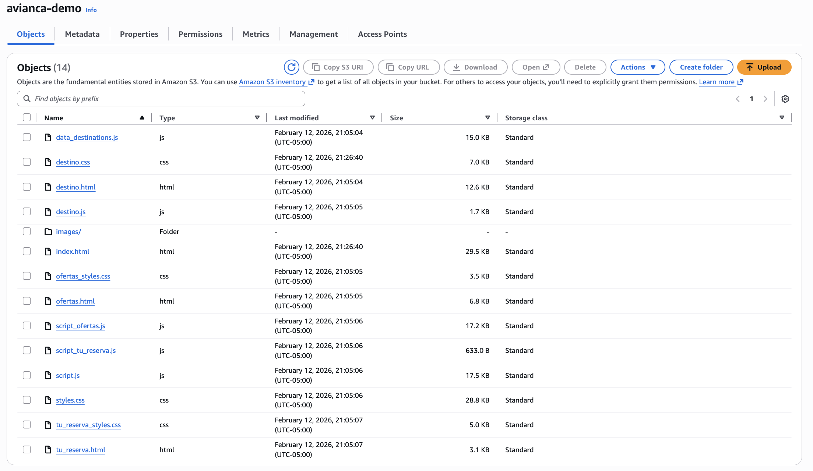
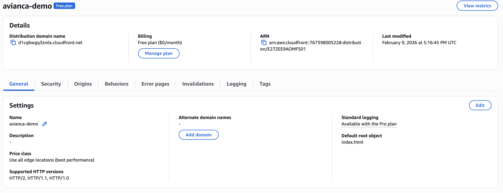
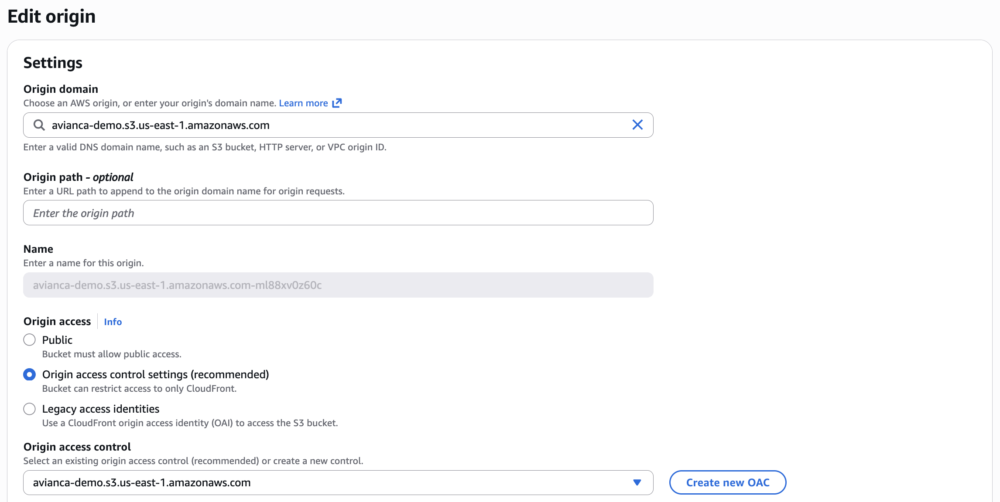
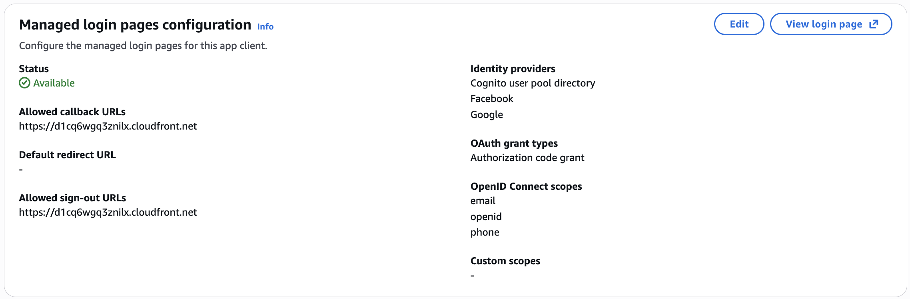
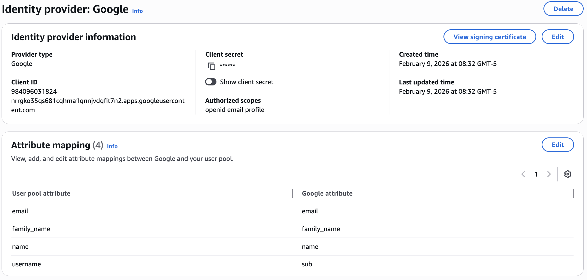
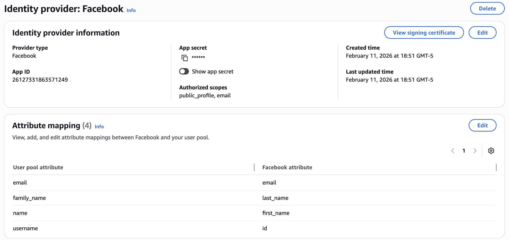

# Avianca Demo AWS

Desarrollo de página web estática alojada en los servicios de **AWS**, con integración de inteligencia artificial, base de datos relacional, autenticación federada y asistente de voz.

[**Web Page**](https://d1cq6wgq3znilx.cloudfront.net)

---

## Arquitectura General

```
Usuario
  │
  ▼
CloudFront (CDN + HTTPS)
  │
  ├── S3 (Frontend estático: HTML, CSS, JS)
  │
  ├── Cognito (Autenticación OAuth2/PKCE + Google + Facebook)
  │
  └── API Gateway (REST API)
        │
        ├── GET  /flights        → Lambda (búsqueda en RDS MySQL)
        ├── POST /chat           → Lambda (OpenAI GPT-4o-mini + tool use)
        ├── POST /agent          → Lambda (recomendaciones / reservas)
        └── GET  /lambda-bookings/{code} → Lambda (consulta RDS)
```

---

## Despliegue en AWS

### Paso 1: Crear el Bucket S3 y Subir los Archivos



### Paso 2: Configurar Política del Bucket

> Bucket S3: Permissions

```json
{
    "Version": "2008-10-17",
    "Id": "PolicyForCloudFrontPrivateContent",
    "Statement": [
        {
            "Sid": "AllowCloudFrontServicePrincipal",
            "Effect": "Allow",
            "Principal": {
                "Service": "cloudfront.amazonaws.com"
            },
            "Action": "s3:GetObject",
            "Resource": "arn:aws:s3:::avianca-demo/*",
            "Condition": {
                "StringEquals": {
                    "AWS:SourceArn": "arn:aws:cloudfront::767398005228:distribution/E27ZEE9AOMFS01"
                }
            }
        }
    ]
}
```

### Paso 3: Configurar CloudFront



#### Origin

> Se debe establecer OAC (Origin Access Control) para que CloudFront pueda acceder al bucket S3 privado.



### Paso 4: Configurar Cognito

**`traditional web application` → `email - phone (SNS) - username` → `required attributes` → `url redirection (CloudFront)`**



| Parámetro | Valor |
|---|---|
| Dominio | `us-east-1qawpfkusl.auth.us-east-1.amazoncognito.com` |
| Client ID | `6oe10kr7ejbcu5cmhd2g8he09a` |
| Redirect URI | `https://d1cq6wgq3znilx.cloudfront.net` |
| Flujo | OAuth2 / PKCE |
| Tokens almacenados | `idToken`, `accessToken`, `refreshToken` en `localStorage` |

### Paso 5: Social and External Providers

#### Google

**GCP: `Create OAuth (Origin -> Cognito Domain + /oauth2/idpresponse)`**

- **Google Cloud Platform → Create Project**
- **Configure OAUTH Consent Screen**
    - **APIs & Services → OAuth consent screen**
    - **User Type → `External`**
    - **Authorized Domains → `cognito.domain/oauth2/idpresponse`**

- **Add Identity Provider (Cognito)**
  - **Client ID**
  - **Client Secret**
  - **Scopes → `openid email profile`**

- **Enable identity providers**
    - **Login pages → `edit`**
    - **Add identity provider → `cognito google`**



#### Facebook

- **Meta Developers → Create App**
    - **`Otros` → `Consumidor`**
- **Add Product → `Facebook Login`**
    - **Add valid OAUTH redirect URI `https://YOUR_COGNITO_DOMAIN/oauth2/idpresponse`**
- **Enable permissions: `email` `public_profile`**
    - **Client OAuth Login → ON**
    - **Web OAuth Login → ON**
    - **Use Strict Mode for Redirect URI → ON**
    - **Enforce HTTPS → ON**
- **Required fields to remove warning**
    - **Privacy policy URL (`CloudFront`)**
    - **Data deletion URL (`CloudFront`)**
- **Switch App to live**

- **Add Identity Provider (Cognito)**
  - **App ID**
  - **App Secret**
  - **Scopes → `public_profile, email`**

- **Enable identity providers**
    - **Login pages → `edit`**
    - **Add identity provider → `cognito facebook`**



### Paso 6: Barrera de Autenticación (PKCE en index.html)

La página de entrada implementa el flujo PKCE completo en el navegador sin backend intermedio:

```html
<script>
    const COGNITO_DOMAIN = "https://us-east-1qawpfkusl.auth.us-east-1.amazoncognito.com";
    const CLIENT_ID = "6oe10kr7ejbcu5cmhd2g8he09a";
    const REDIRECT_URI = "https://d1cq6wgq3znilx.cloudfront.net";

    function generateRandomString(length) {
        const charset = "ABCDEFGHIJKLMNOPQRSTUVWXYZabcdefghijklmnopqrstuvwxyz0123456789";
        let result = "";
        const values = crypto.getRandomValues(new Uint8Array(length));
        values.forEach(v => result += charset[v % charset.length]);
        return result;
    }

    async function sha256(plain) {
        const encoder = new TextEncoder();
        const data = encoder.encode(plain);
        const hash = await crypto.subtle.digest("SHA-256", data);
        return btoa(String.fromCharCode(...new Uint8Array(hash)))
            .replace(/\+/g, "-")
            .replace(/\//g, "_")
            .replace(/=+$/, "");
    }

    async function redirectToLogin() {
        const codeVerifier = generateRandomString(64);
        const codeChallenge = await sha256(codeVerifier);

        localStorage.setItem("pkce_verifier", codeVerifier);

        const loginUrl = `${COGNITO_DOMAIN}/login` +
            `?client_id=${CLIENT_ID}` +
            `&response_type=code` +
            `&scope=openid+email` +
            `&redirect_uri=${encodeURIComponent(REDIRECT_URI)}` +
            `&code_challenge=${codeChallenge}` +
            `&code_challenge_method=S256`;

        window.location.href = loginUrl;
    }

    async function handleCallback() {
        const params = new URLSearchParams(window.location.search);
        const code = params.get("code");

        if (!code) return false;

        const codeVerifier = localStorage.getItem("pkce_verifier");

        const response = await fetch(`${COGNITO_DOMAIN}/oauth2/token`, {
            method: "POST",
            headers: { "Content-Type": "application/x-www-form-urlencoded" },
            body: new URLSearchParams({
                grant_type: "authorization_code",
                client_id: CLIENT_ID,
                code: code,
                redirect_uri: REDIRECT_URI,
                code_verifier: codeVerifier
            })
        });

        const tokens = await response.json();
        localStorage.setItem("idToken", tokens.id_token);
        localStorage.setItem("accessToken", tokens.access_token);
        localStorage.setItem("refreshToken", tokens.refresh_token);

        window.history.replaceState({}, document.title, "/");
        return true;
    }

    (async () => {
        const logged = await handleCallback();
        const idToken = localStorage.getItem("idToken");
        if (!logged && !idToken) redirectToLogin();
    })();
</script>
```

---

## API Gateway

**Base URL:** `https://qxsi6eee0k.execute-api.us-east-1.amazonaws.com`

| Método | Ruta | Descripción | Auth |
|--------|------|-------------|------|
| `GET` | `/flights` | Búsqueda de vuelos por origen/destino | No |
| `POST` | `/chat` | Asistente IA (Ava) con agentic loop | `idToken` |
| `POST` | `/agent` | Procesamiento interno: recomendaciones y reservas | Interno |
| `GET` | `/lambda-bookings/{code}` | Consulta de reserva por código | `idToken` |

### Parámetros

**`GET /flights`**
```
?origin=BOG&destination=MDE
```

**`POST /chat`**
```json
{
  "messages": [
    { "role": "user", "content": "Quiero viajar a Cartagena" }
  ]
}
```

**`GET /lambda-bookings/{code}`**
```
Authorization: Bearer <idToken>
```

### CORS

```
Access-Control-Allow-Origin: *
Access-Control-Allow-Headers: Content-Type, Authorization
Access-Control-Allow-Methods: POST, GET, OPTIONS
```

---

## Lambda Functions

### `lambda_chat.js` — Asistente IA (POST /chat)

Función Node.js desplegada en AWS Lambda que implementa un **agentic loop** sobre OpenAI con soporte de herramientas (tool use).

#### Flujo de ejecución

```
Browser (POST /chat)
  │
  ▼
Lambda handler
  │
  ▼
OpenAI API (gpt-4o-mini)
  │
  ├── finish_reason: "tool_calls"
  │     ├── search_flights → GET /flights
  │     └── execute_action → POST /agent
  │           └── resultado devuelto a OpenAI
  │
  └── finish_reason: "stop" → respuesta final al browser
```

#### Configuración

| Parámetro | Valor |
|---|---|
| Modelo | `gpt-4o-mini` |
| Max tokens | `800` |
| Temperature | `0.7` |
| Max iteraciones loop | `5` |
| Variable entorno | `OPENAI_API_KEY` |

#### Herramientas disponibles (tools)

**`search_flights`**
```json
{
  "name": "search_flights",
  "description": "Busca vuelos disponibles entre dos ciudades",
  "parameters": {
    "origin": "Código IATA origen (ej: BOG)",
    "destination": "Código IATA destino (ej: MDE)",
    "date": "Fecha en formato YYYY-MM-DD"
  }
}
```

**`execute_action`**
```json
{
  "name": "execute_action",
  "description": "Ejecuta acción contextual: recomendación de destino o consulta de reserva",
  "parameters": {
    "context": "Contexto completo de la conversación"
  }
}
```

#### System Prompt (Ava)

La función define a **Ava**, asistente virtual de Avianca en español, con tres flujos principales:

1. **Búsqueda de vuelos** — Recopila origen, destino y fecha → llama `search_flights`
2. **Recomendación de destino** — Hace 10 preguntas (paisaje, actividad, clima, gastronomía, compañía, duración, vida nocturna, nacional/intl, presupuesto, nivel aventura) → llama `execute_action`
3. **Consulta de reserva** — Solicita código (formato 3 letras + 3 números) → llama `execute_action`

---

## RDS — Base de Datos MySQL

**Motor:** MySQL  
**Base de datos:** `avianca_flights`  
**Acceso:** Solo desde Lambda (VPC o credenciales en variables de entorno), el browser nunca conecta directamente.

### Esquema (9 tablas)

```
airports ──────────┐
                   ├── flights ──── flight_stops
aircraft ──────────┘     │
                         │
                    booking_legs ──── bookings
                         │               │
                    passengers ──────────┘
                         │
                    ┌────┴────┐
              passenger_seats  passenger_baggage
```

| Tabla | Descripción |
|---|---|
| `airports` | Códigos IATA, ciudad, país, tipo (national/international) |
| `aircraft` | Modelo de aeronave y capacidad total |
| `flights` | Horario recurrente, precios en COP, asientos disponibles por cabina |
| `flight_stops` | Escalas por vuelo (0 filas = vuelo directo) |
| `bookings` | Una fila por transacción de compra; código confirmación, estado, total |
| `booking_legs` | Tramo de ida y/o vuelta con fecha seleccionada por el usuario |
| `passengers` | Un pasajero por fila, pasajero titular marcado con flag |
| `passenger_seats` | Asiento asignado por pasajero por tramo |
| `passenger_baggage` | Equipaje seleccionado por pasajero (`hand` / `bag23` / `bag32`) |

### Consultas clave

**Búsqueda de vuelos disponibles:**
```sql
SELECT f.*, a1.city AS origin_city, a2.city AS destination_city, ac.model AS aircraft
FROM flights f
JOIN airports a1 ON f.origin_iata = a1.iata_code
JOIN airports a2 ON f.destination_iata = a2.iata_code
JOIN aircraft ac ON f.aircraft_id = ac.id
WHERE f.origin_iata = 'BOG'
  AND f.destination_iata = 'MDE'
  AND f.is_active = TRUE
  AND f.seats_economy > 0;
```

**Recuperación completa de una reserva:**
```sql
SELECT b.*, bl.*, f.flight_number, f.departure, f.arrival,
       p.first_name, p.last_name, p.is_lead,
       ps.seat_code, pb.baggage_type, pb.price
FROM bookings b
JOIN booking_legs bl ON b.id = bl.booking_id
JOIN flights f ON bl.flight_id = f.id
JOIN passengers p ON b.id = p.booking_id
LEFT JOIN passenger_seats ps ON p.id = ps.passenger_id AND bl.id = ps.leg_id
LEFT JOIN passenger_baggage pb ON p.id = pb.passenger_id
WHERE b.booking_code = 'XK29TF';
```

### Archivos SQL

| Archivo | Propósito |
|---|---|
| `sql/DDL.sql` | `CREATE TABLE` — ejecutar una sola vez para crear el esquema |
| `sql/INSERT.sql` | Datos semilla (aeropuertos, aeronaves, vuelos) |
| `sql/INSERT APLICADOS.sql` | Inserts ya aplicados a la base de datos |
| `sql/QUERIES.sql` | Consultas de lectura y reportes analíticos |

---

## OpenAI Integration

| Parámetro | Valor |
|---|---|
| Modelo | `gpt-4o-mini` |
| Endpoint | `https://api.openai.com/v1/chat/completions` |
| Autenticación | `Bearer $OPENAI_API_KEY` (variable de entorno en Lambda) |
| Max tokens | `800` |
| Temperature | `0.7` |

La integración usa **function calling** (tool use) de OpenAI. Lambda ejecuta el agentic loop: recibe la respuesta, detecta si hay `tool_calls`, ejecuta la herramienta correspondiente, agrega el resultado al historial y vuelve a llamar a OpenAI hasta obtener `finish_reason: "stop"`.

---

## VAPI — Asistente de Voz

**VAPI** permite llamadas de voz en tiempo real con el asistente Ava directamente desde el navegador.

| Parámetro | Valor |
|---|---|
| SDK | `@vapi-ai/web` (cargado dinámicamente desde `esm.sh`) |
| Public Key | `09d1509b-3228-416c-a1c9-792f208aeb3a` |
| Assistant ID | `c73d03ea-87fb-4fcd-9bf5-db9b813b597d` |
| Chat fallback | `POST /chat` (API Gateway) |

### Widget (`vapi-widget.js`)

Botón flotante (FAB) en todas las páginas con dos modos:

```
FAB (clic)
  │
  ├── Modo Voz  → VAPI SDK → llamada en tiempo real
  │                └── Eventos: call-start, call-end, speech-start, speech-end, error
  │
  └── Modo Chat → POST /chat con historial de mensajes
                  └── Authorization: Bearer <idToken>
```

**Estados del widget:** `idle` → `menu` → `voice` / `chat`

### Configuración de la llamada de voz

```javascript
vapi.start(ASSISTANT_ID);              // Inicia sesión de voz
vapi.on('call-start', () => { ... });  // UI: animación de onda
vapi.on('speech-start', () => { ... });
vapi.on('speech-end', () => { ... });
vapi.on('call-end', () => { ... });    // Restaura UI
vapi.on('error', (e) => { ... });      // Fallback a chat
```

---

## Contentful CMS

**Space ID:** `d4f15mm5mss6`  
**Environment:** `master`  
**CDN API:** `https://cdn.contentful.com`

| Content Type | Descripción |
|---|---|
| `siteHeader` | Navegación y logo del header |
| `siteFooter` | Links e info del footer |
| `destination` | Destinos con imagen, código IATA, país, tipo |
| `attractions` | Lugares turísticos por destino |

Los datos se cargan en runtime via `data_contentful.js` y quedan disponibles como `window.destinations` y `window.tourismData`. El script emite el evento `contentfulDataReady` para sincronizar la inicialización de las páginas.

**Migración de content types (Node.js):**
```bash
node contentful-migration.js
```
Requiere `.env` con `CONTENTFUL_SPACE_ID` y `CONTENTFUL_MANAGEMENT_TOKEN`.

---

## Google Analytics 4

**ID de medición:** `G-9V78277M5X`

Eventos rastreados por página:

| Página | Eventos |
|---|---|
| Home | `search_flights`, `click_offer_card`, `click_experience_card` |
| Resultados | `view_results`, `select_flight_outbound`, `apply_filter`, `begin_checkout` |
| Checkout | `checkout_step`, `select_seat`, `upgrade_to_executive`, `select_baggage`, `purchase` |
| Tu Reserva | `search_reservation`, `reservation_found`, `reservation_not_found` |
| Ofertas | `filter_origin`, `filter_country`, `click_offer_card` |
| Destino | `view_destination`, `click_attraction` |

---

## Despliegue Continuo

```bash
./deploy.sh
```

El script:
1. Sincroniza todos los archivos al bucket S3 `avianca-demo` (excluye `.sh`, `.git/`, `node_modules/`)
2. Crea una invalidación de CloudFront en `/*` para la distribución `E27ZEE9AOMFS01`
3. Espera a que la invalidación complete
4. Confirma la URL en producción

**Requisitos:** AWS CLI configurado con permisos sobre S3 y CloudFront.
